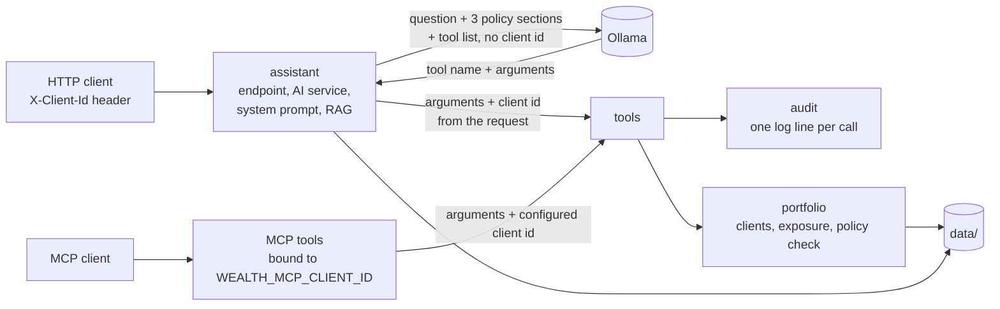

# java-ai-integration-patterns

## What and why

A proof of concept comparing how to add AI capabilities to an enterprise Java application with Spring Boot (Spring AI) and with Quarkus (quarkus-langchain4j): tool calling, retrieval-augmented generation (RAG) and the Model Context Protocol (MCP).

Both apps implement the same use case: a wealth-management assistant. A signed-in client asks questions about their own portfolio ("what's my exposure to tech?") or about the bank's policy documents ("what does the investment policy say about crypto?"). The assistant answers with tools over a mock portfolio service and RAG over three documents. The same tools are exposed through an MCP server.

All data is fictional and lives in `data/`, shared by both apps. Domain terms are defined in [CONTEXT.md](CONTEXT.md), decisions in [docs/adr](docs/adr).

## What's in this repo

| Path | What it is |
|---|---|
| `spring-app/` | The Spring Boot 4.1.1 + Spring AI 2.0.1 app (Maven project). |
| `quarkus-app/` | The Quarkus 3.40.1 + quarkus-langchain4j app (Maven project). |
| `data/clients.json` | The three fictional clients and their holdings, read by both apps ([ADR 0002](docs/adr/0002-shared-data-folder-not-shared-library.md)). |
| `data/documents/*.txt` | The three fictional policy documents used for RAG: investment policy, fee schedule, risk disclosure. |
| `docs/adr/` | Decision records 0001 to 0007. |
| `docs/ollama-setup.md` | Ollama setup in detail, including Windows and troubleshooting. |
| `scripts/ollama.sh` | Installs, starts and pulls models for a project-local Ollama (Linux and macOS). |
| `CONTEXT.md` | Glossary of domain terms. |
| `.gitignore` | Ignores build output, IDE files, `.env` and `.ollama/`. |

## How to run

### 1. Requirements

- Java 21 and Maven 3.9.
- To install Ollama: on Linux `curl` and `zstd`, on macOS `curl` and `unzip`, on Windows PowerShell.
- Disk space for two models. The default chat model was chosen to fit in 2 GB of VRAM ([ADR 0004](docs/adr/0004-single-local-llm-provider.md)).
- For MCP only: Node.js, to run the MCP Inspector.

### 2. Install Ollama

Ollama is installed inside the repository, in `.ollama/`, at a pinned version. Nothing is installed system-wide.

```
scripts/ollama.sh install
```

On Windows, follow the PowerShell steps in [docs/ollama-setup.md](docs/ollama-setup.md#windows).

### 3. Start Ollama

```
scripts/ollama.sh serve        # keep this terminal open
```

It listens on `127.0.0.1:11434`. Windows: see [docs/ollama-setup.md](docs/ollama-setup.md#windows).

### 4. Pull the models

In a second terminal:

```
scripts/ollama.sh pull         # qwen2.5:1.5b (chat) and nomic-embed-text (embeddings)
```

`OLLAMA_CHAT_MODEL` and `OLLAMA_EMBEDDING_MODEL` choose other models, both here and in the apps. `OLLAMA_BASE_URL` points the apps at another Ollama server.

### 5. Start the Spring app

Ollama must be running first: both apps embed the policy documents at startup ([ADR 0005](docs/adr/0005-in-memory-vector-store-ingested-at-startup.md)). Start each app from its own folder, so `../data` resolves.

```
cd spring-app
mvn spring-boot:run            # http://localhost:8080
```

### 6. Start the Quarkus app

In another terminal:

```
cd quarkus-app
mvn quarkus:dev                # http://localhost:8081
```

Quarkus Dev Services are switched off, so no Docker is needed. Both apps listen on 127.0.0.1 only.

### 7. Try it

`X-Client-Id` stands in for an authenticated user ([ADR 0001](docs/adr/0001-client-identity-from-request-context.md)). The fixture clients are `C-1001`, `C-1002` and `C-1003`; any other id gets 403. Use port 8080 for Spring and 8081 for Quarkus.

curl:

```
curl -s localhost:8080/assistant -H 'X-Client-Id: C-1002' -H 'Content-Type: application/json' \
     -d '{"question":"Is my crypto exposure within policy?"}'
```

PowerShell:

```
Invoke-RestMethod -Method Post -Uri http://localhost:8080/assistant -Headers @{ "X-Client-Id" = "C-1002" } `
  -ContentType "application/json" -Body '{"question":"Is my crypto exposure within policy?"}'
```

Swagger UI: http://localhost:8080/swagger-ui/index.html (Spring) or http://localhost:8081/q/swagger-ui (Quarkus). Choose "Try it out" on `POST /assistant`. Swagger UI is there to make the PoC easier to try, not part of the comparison.

### 8. MCP

The same tools are served over MCP at `/mcp` on each app. MCP requests carry no user identity in this PoC, so the MCP server acts for one client that you set when starting the app. Without it, no tools are exposed ([ADR 0007](docs/adr/0007-mcp-server-bound-to-one-client.md)).

```
WEALTH_MCP_CLIENT_ID=C-1001 mvn spring-boot:run                       # Linux/macOS, or mvn quarkus:dev
$env:WEALTH_MCP_CLIENT_ID="C-1001"; mvn spring-boot:run               # PowerShell
```

Then run `npx @modelcontextprotocol/inspector`, choose transport "Streamable HTTP" and URL `http://localhost:8080/mcp` (or 8081), connect, and open Tools > List Tools. To see another client, restart the app with another id.

### 9. Run the tests

From the repository root:

```
(cd spring-app && mvn test)
(cd quarkus-app && mvn test)
```

Each app has 27 tests. They need no Ollama, no network and no Docker: a small HTTP server in the tests (`FakeOllama`) stands in for Ollama, so the real framework clients, tool loop and retrieval run.

## Architecture

Both apps have the same four modules and the same flow; only the framework classes differ ([CONTEXT.md](CONTEXT.md) defines the terms).



The client id travels next to the model, never through it: the model chooses a tool and its arguments, and the application adds the client ([ADR 0001](docs/adr/0001-client-identity-from-request-context.md)).

## Comparison

The yardstick is the brief this PoC was built to: the same use case, module layout and behaviour in both apps, the guardrail of [ADR 0001](docs/adr/0001-client-identity-from-request-context.md), an audit line for every tool call, RAG over the shared documents, the same tools over MCP, one local provider, and tests that run without a model.

| Requirement | Spring Boot + Spring AI | Quarkus + quarkus-langchain4j |
|---|---|---|
| Same modules: `portfolio`, `assistant`, `tools`, `audit` | 11 main files, 468 non-blank lines. The `ChatClient` and system prompt live in the controller. | 11 main files, 499 non-blank lines. A `@RegisterAiService` interface holds the system prompt; Quarkus implements it at build time. |
| Domain logic (`portfolio`) | Plain records. | The same records, copied unchanged; only the repository's wiring differs. |
| Tools never take a client id (ADR 0001) | Client passed in Spring AI's `ToolContext`, filled from the header. | Client passed in LangChain4j's `InvocationParameters`, filled from the header. |
| Guardrail test | Checks the tool schemas built by `ToolCallbacks.from`. | Checks the tool schemas in the actual request sent to Ollama, because Quarkus builds them at build time. |
| Unknown client | 403 before the model is called. | 403 before the model is called. |
| Audit of every tool call | `AuditedToolCallback` wraps each `ToolCallback`. Logs the model's raw JSON arguments. | `ToolCallAudit`, a CDI interceptor on the tools bean (`@Audited`). Logs the Java arguments as JSON. |
| Policy limits compared in code ([ADR 0006](docs/adr/0006-policy-limits-checked-in-code.md)) | `policyCheck` tool: asset-class ranges and crypto rules, status and deviation per limit; issuer, sector and region listed as not checked. | Same `PolicyCheck` record, same tool. |
| RAG over policy documents ([ADR 0005](docs/adr/0005-in-memory-vector-store-ingested-at-startup.md)) | One chunk per numbered section, `SimpleVectorStore` filled at startup, `QuestionAnswerAdvisor`, top 3. | Same chunking, `InMemoryEmbeddingStore` filled at startup, `DefaultRetrievalAugmentor` with `DefaultContentInjector`, top 3. |
| Retrieval template that lets the model call tools (ADR 0006) | Custom template with `{query}` and `{question_answer_context}`. | Same wording with `{{userMessage}}` and `{{contents}}`. |
| Same tools over MCP | Reuses the same `ToolCallback`s, each wrapped in a `BoundToClient` callback. | The MCP extension has its own `@Tool`, so each tool is declared again in `McpServerTools` and delegates to `PortfolioTools`. |
| MCP bound to one client, off by default (ADR 0007) | No tools registered without `WEALTH_MCP_CLIENT_ID`. Unknown client stops the app at startup. | A `ToolFilter` hides every tool, and the server does not announce the tools capability. Unknown client stops the app at startup. |
| MCP call with a `clientId` argument | Rejected by schema validation before the tool runs. | Accepted; the argument is ignored and the configured client's data is returned. |
| MCP transport | Streamable HTTP, stateless: no MCP session. | Streamable HTTP with an MCP session per connection. |
| MCP read-only hints | Not set: Spring AI 2.0.1 sets them only through `@McpTool`. | Set (`readOnlyHint` and related hints). |
| One local provider ([ADR 0004](docs/adr/0004-single-local-llm-provider.md)) | Ollama, same environment variables. | Ollama, same environment variables. |
| Tests without a model or network | 27 tests, `FakeOllama`. | 27 tests, `FakeOllama`. Dev Services switched off. |

**How the client reaches the tools.** Both frameworks offer a per-call object that the application fills and the model never sees: `ToolContext` in Spring AI, `InvocationParameters` in LangChain4j. The guardrail is the same in both, and both tests fail if a tool gains a client parameter. Nothing is kept between requests in either app; [CONTEXT.md](CONTEXT.md) defines the current client.

**Audit.** Spring audits by wrapping tool callbacks, so it sees exactly what the model sent, but every path that exposes tools must wrap them. Quarkus audits with an interceptor on the bean, so assistant and MCP calls are covered by one annotation, but it logs Java arguments rather than the model's raw JSON. Both write the same `tool_call client=… tool=… arguments=… outcome=…` line.

**MCP.** This is where the frameworks differ most. Spring AI exposes the same tool definitions over MCP with no second declaration, runs stateless and rejects undeclared arguments. Quarkus needs each tool declared twice, keeps a session per connection and ignores undeclared arguments, but supports read-only hints and can hide the tools capability completely. One Quarkus default needs care: it exposes LangChain4j `@Tool` methods over MCP automatically, which would have bypassed the client binding, so `quarkus.mcp.server.support-langchain4j-annotations=false` is set.

**RAG.** The concepts match one to one: an in-memory store, a retriever, and an advisor (Spring) or content injector (Quarkus) that adds the sections to the question. Spring AI's default retrieval template tells the model to answer only from the excerpts, which stopped it calling tools in replays*. Both apps now use the same custom wording.

**What the model receives.** Captured from both apps for the same question, the system prompt, tool names and descriptions, and retrieved sections are identical. Three differences remain:

- `exposure.dimension` is required in Spring's tool schema and not required in Quarkus's.
- Quarkus sends `temperature` 0.8, `top_k` 40 and `top_p` 0.9 explicitly. Spring sends no options, so Ollama's defaults apply.
- Retrieved sections are separated by a blank line in Quarkus and by a single line separator in Spring (`System.lineSeparator()`, so `\r\n` on Windows).

## Findings

- **The guardrail works the same in both frameworks.** Both offer a per-call object for data the model must not see (`ToolContext`, `InvocationParameters`), so no tool needs a client parameter. Both guardrail tests fail when one is added.
- **Framework defaults mattered more than framework APIs.** Spring AI's default retrieval template suppressed tool calls*. The Quarkus MCP server exposes LangChain4j tools automatically unless switched off. Quarkus Dev Services start Docker containers in tests unless switched off. Spring Boot, and Quarkus outside dev mode, listen on all network interfaces by default. Each of these is now set explicitly, in code or in `application.properties`.
- **Calculations belong in Java.** The small model compared figures with limits wrongly even when they were in the prompt*, so `policyCheck` does the comparison and the model only reports it ([ADR 0006](docs/adr/0006-policy-limits-checked-in-code.md)).
- **MCP is where the apps differ most and where identity is least solved.** Neither app has per-user identity over MCP. Behaviour on undeclared arguments, sessions and hints differs (see the table). The Quarkus platform includes an OIDC extension for its MCP server (`quarkus-mcp-server-oidc`); it was not tried here.
- **An HTTP-level fake model tests both frameworks well.** The same small `FakeOllama` runs the real clients, tool loop and retrieval in both apps. In Quarkus it is also the only place to check the tool schema the model really sees, since Quarkus builds it at build time.

### Results that depend on the model*

These come from runs with `qwen2.5:1.5b` locally, on client C-1002's question "Is my crypto exposure within policy?". The first three are replays of the Spring app's requests sent straight to Ollama:

- With Spring AI's default retrieval template, the model called a tool in 2 of 10 runs; with the custom template, in 10 of 10*.
- With the correct figures already in the prompt, it compared them with the policy limits correctly in 0 of 10 runs*. This is why limits are compared in Java ([ADR 0006](docs/adr/0006-policy-limits-checked-in-code.md)).
- With `policyCheck`, 3 of 6 answers were correct. Every run that called `policyCheck` was correct, every run that did not was wrong*.
- The Quarkus app was only run once per question, not replayed. Both apps answered the same question wrongly, in different ways*.

Startup time and memory were not measured.

\* I could only run `qwen2.5:1.5b`, which fits in a 2 GB GPU and often chooses the wrong tool or answers wrongly. I could not test with a model capable enough to do the apps justice, so these numbers describe the small model, not the frameworks or the architecture.

## Recommendations

For this kind of integration (tools over existing domain services, RAG over a few documents, MCP for other AI clients):

- **Choose by the platform the team already runs.** The integration code is close in size and structure in both apps (11 files each), and the domain code is identical. Startup time and memory were not measured, so they cannot decide it here.
- **Spring Boot + Spring AI fits better when MCP is a main channel.** One tool definition serves the assistant and MCP, the MCP server can run stateless, and undeclared arguments are rejected (`spring-app/.../tools/McpServerTools.java`, `McpServerEndToEndTest`).
- **Quarkus + quarkus-langchain4j fits better when cross-cutting rules matter most.** A CDI interceptor audits every caller of the tools bean with one annotation (`ToolCallAudit`), the AI service is a declared interface, and MCP tools can carry read-only hints.
- **Whichever is chosen:**
  - keep identity out of tool signatures and pass it in the per-call context ([ADR 0001](docs/adr/0001-client-identity-from-request-context.md));
  - do lookups, calculations and comparisons in Java, and let the model choose tools and write the answer ([ADR 0006](docs/adr/0006-policy-limits-checked-in-code.md));
  - audit at the tool boundary, not in the prompt;
  - review the framework defaults listed under Findings before going live;
  - test against an HTTP-level fake model, so tests need no model and still run the real framework code.
- **Do not choose on answer quality from this PoC.** It was only tried with a small local model*.

## Limitations and what I'd do next

- **No authentication.** `X-Client-Id` is trusted as sent ([ADR 0001](docs/adr/0001-client-identity-from-request-context.md)). Next: take the client from a token issued by the bank's identity provider.
- **MCP is bound to one configured client.** Anyone who can reach `/mcp` reads that client's data; binding to 127.0.0.1 limits this to the local machine ([ADR 0007](docs/adr/0007-mcp-server-bound-to-one-client.md)). Next: per-user authentication on the MCP endpoint (OAuth 2.1, as the MCP specification describes).
- **Audit is a plain log line.** It can be lost or edited. Next: an append-only, tamper-evident store.
- **In-memory vector store, filled at startup.** Startup needs a running Ollama and includes embedding time ([ADR 0005](docs/adr/0005-in-memory-vector-store-ingested-at-startup.md)). Next: a persistent store with offline ingestion.
- **Section chunking.** One chunk per numbered section only works for small, well-structured documents, and retrieval runs on every question, even pure portfolio ones ([ADR 0005](docs/adr/0005-in-memory-vector-store-ingested-at-startup.md)). Next: a general splitter and retrieval only when the question needs it.
- **Policy limits copied into code.** They exist twice, in the policy text and in `PolicyCheck`, and must change together. Issuer, sector and region limits are not checked ([ADR 0006](docs/adr/0006-policy-limits-checked-in-code.md)).
- **Domain code exists twice.** The `portfolio` module is copied in both apps and could drift; the same tests over the same fixtures keep it aligned ([ADR 0002](docs/adr/0002-shared-data-folder-not-shared-library.md)).
- **Small local model.** Only `qwen2.5:1.5b` was run ([ADR 0004](docs/adr/0004-single-local-llm-provider.md)), so answer quality and tool choice were not evaluated fairly*. Next: rerun the replays with a capable model and a fixed set of questions per client.
- **Not measured.** Startup time, memory and native builds. Next: measurement scripts in `scripts/`, run on stated hardware.
- **Small differences left between the apps.** `exposure.dimension` is required only in Spring's tool schema, and only Quarkus sends sampling options (see Comparison). Next: align them so model replays compare like with like.
- **Convenience features always on.** Swagger UI is enabled in both apps, and the 403 message for an unknown client confirms which ids exist. Next: switch Swagger UI off outside development and return the same error for every rejected client.

## Disclosure

This project is a proof of concept, built to compare integration patterns. It is not a finished product and is not meant for production use: authentication, persistence and operations are deliberately out of scope, and all data is fictional. Answer quality was only tried with a small local model, so it says little about what either framework can do with a capable one.

It was co-developed with Claude Code, using AI-assisted development.
